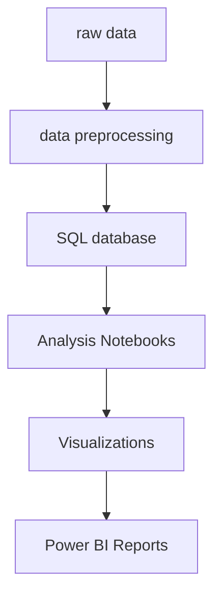

# Retail Sales Analysis

## Project Overview
This project analyzes retail sales data to extract insights and visualize trends using Python, SQL, and Power BI.

## Folder Structure



- **data/**: Contains raw and processed data files.
- **sql/**: SQL scripts and Python scripts for database setup and data import.
- **notebooks/**: Jupyter notebooks for exploratory data analysis and modeling.
- **visualizations/**: Python scripts for generating charts and plots.
- **powerbi/**: Guides and templates for Power BI reporting.
- **docs/**: Project documentation and checklists.

## Data Flow
1. Raw data is stored in `data/raw/`.
2. Data is processed and imported into a SQL database using scripts in `sql/`.
3. Analysis is performed in Jupyter notebooks (`notebooks/`).
4. Visualizations are created using scripts in `visualizations/` and Power BI (`powerbi/`).

## Getting Started
1. Install dependencies: `pip install -r requirements.txt`
2. Set up the database: see `sql/setup_database.sql` and `sql/import_data.py`
3. Explore the analysis in `notebooks/sales_analysis.ipynb`
4. Generate visualizations or use Power BI templates.

## Authors
- Your Name Here

---

# Retail Sales Analysis Project

A beginner-friendly data analysis project that helps you learn SQL and data visualization through analyzing retail sales data.

## Project Overview

This project will analyze sales data from a fictional retail store to help understand:
- Sales trends over time
- Product performance
- Customer behavior
- Regional sales patterns
- Revenue analysis

## Project Structure
```
retail_sales_analysis/
├── data/                  # Contains all datasets
│   ├── raw/              # Original datasets
│   └── processed/        # Cleaned and processed data
├── sql/                  # SQL queries and scripts
├── notebooks/            # Jupyter notebooks for analysis
├── visualizations/       # Generated visualizations
└── docs/                 # Documentation and guides
```

## Step-by-Step Learning Path

### Step 1: Environment Setup
1. Install required tools:
   - Python 3.8 or higher
   - MySQL or PostgreSQL
   - Jupyter Notebook
   - Tableau Public (free version)

2. Install Python packages:
```bash
pip install pandas numpy matplotlib seaborn jupyter
```

### Step 2: Data Understanding
We'll work with three main datasets:
1. `sales.csv` - Contains daily sales transactions
2. `products.csv` - Product catalog information
3. `customers.csv` - Customer demographic data

### Step 3: SQL Learning Path
1. Basic SQL Operations
   - SELECT statements
   - WHERE clauses
   - JOIN operations
   - GROUP BY and aggregations
   - ORDER BY and sorting

2. Advanced SQL Concepts
   - Subqueries
   - Window functions
   - Common Table Expressions (CTEs)

### Step 4: Data Analysis
1. Data Cleaning
   - Handling missing values
   - Removing duplicates
   - Data type conversions
   - Data validation

2. Exploratory Data Analysis
   - Summary statistics
   - Distribution analysis
   - Correlation analysis
   - Time series analysis

### Step 5: Visualization
1. Basic Charts
   - Bar charts
   - Line charts
   - Pie charts
   - Scatter plots

2. Advanced Visualizations
   - Heat maps
   - Box plots
   - Geographic maps
   - Interactive dashboards

## Getting Started

1. Clone this repository
2. Set up your database
3. Import the sample datasets
4. Follow the SQL tutorials in the `sql/` directory
5. Work through the Jupyter notebooks in order

## Learning Resources

1. SQL Basics:
   - W3Schools SQL Tutorial
   - Mode Analytics SQL Tutorial

2. Data Visualization:
   - Tableau Public Gallery
   - Matplotlib Documentation
   - Seaborn Tutorial

## Project Milestones

1. Week 1: Environment Setup & Basic SQL
2. Week 2: Data Cleaning & Basic Analysis
3. Week 3: Advanced SQL & Intermediate Analysis
4. Week 4: Visualization & Dashboard Creation

## Next Steps

Let's begin with setting up your environment and importing the sample datasets. Would you like to proceed with the first step? 