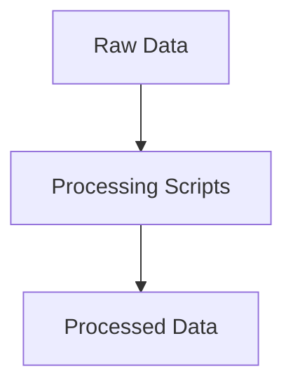

# Data Folder

This folder contains all datasets used in the project.

## Structure
- `raw/`: Original, unmodified data files (CSV format).
- `processed/`: Cleaned and transformed data ready for analysis.

## Data Flow

Raw data is ingested from the `raw/` folder, processed using scripts, and the results are saved in the `processed/` folder for further analysis. 