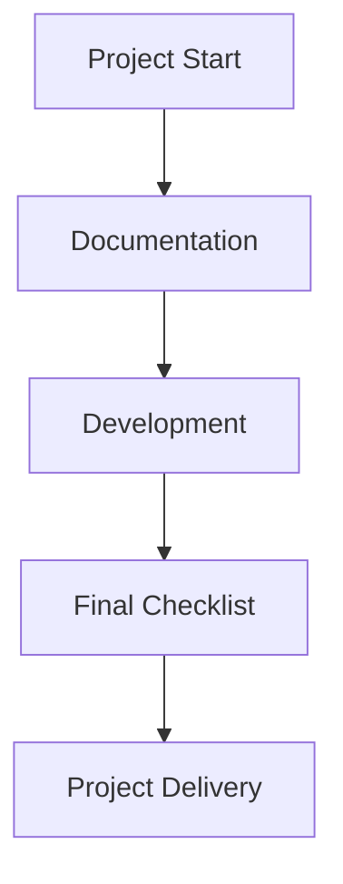

# Docs Folder

This folder contains project documentation, checklists, and supporting materials.

## Structure
- `project_documentation.md`: Detailed technical and project documentation.
- `final_checklist.md`: Checklist for project completion.

## Documentation Workflow

Documentation supports the project from initial setup through to final delivery. 