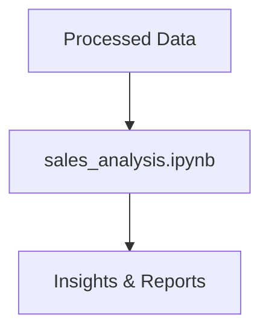

# Notebooks Folder

This folder contains Jupyter notebooks for exploratory data analysis, modeling, and reporting.

## Structure
- `sales_analysis.ipynb`: Main notebook for analyzing sales data and generating insights.

## Analysis Workflow

Processed data is loaded into notebooks for analysis, visualization, and reporting. 