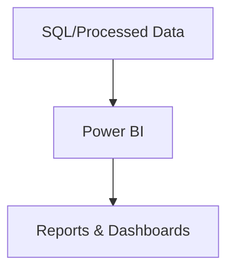

# Power BI Folder

This folder contains resources for building and sharing Power BI reports.

## Structure
- `connection_guide.md`: Instructions for connecting Power BI to the database.
- `report_template.md`: Template for creating custom Power BI dashboards.

## Reporting Workflow

Power BI connects to the project data and enables interactive reporting and dashboard creation. 