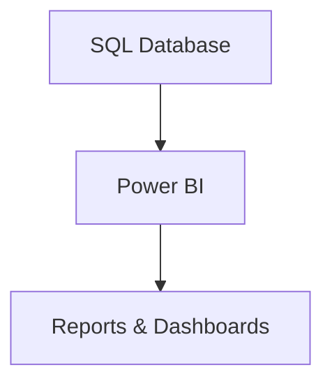

# Power BI Connection Guide

## Technical Overview

This guide explains how to connect Power BI to the SQL database and use the data for reporting.

---

## Step 1: Install Power BI Desktop
1. Download Power BI Desktop from: https://powerbi.microsoft.com/desktop/
2. Install and open Power BI Desktop

## Step 2: Connect to MySQL Database
1. Click "Get Data" in the Home tab
2. Select "MySQL database"
3. Enter connection details:
   - Server: localhost
   - Database: retail_sales
   - Username: root
   - Password: [your MySQL password]

## Step 3: Import Tables
Select these tables:
- sales
- products
- customers

## Step 4: Create Relationships
Power BI will automatically detect relationships based on foreign keys:
- sales.customer_id → customers.customer_id
- sales.product_id → products.product_id

## Step 5: Create Basic Visualizations
1. Sales Overview:
   - Card visual: Total Sales
   - Card visual: Average Sale Amount
   - Card visual: Number of Transactions

2. Sales Trends:
   - Line chart: Sales by Date
   - Bar chart: Sales by Category
   - Bar chart: Top Products by Sales

3. Customer Analysis:
   - Pie chart: Sales by State
   - Bar chart: Customer Age Distribution
   - Table: Top Customers by Sales

4. Product Analysis:
   - Bar chart: Product Performance
   - Pie chart: Sales by Category
   - Table: Product Details with Sales

## Step 6: Create Interactive Dashboard
1. Add filters:
   - Date range
   - Product category
   - Customer state

2. Add slicers:
   - Product selection
   - Customer selection
   - Date selection

3. Add drill-through capabilities:
   - Product details
   - Customer details
   - Sales details

## Step 7: Save and Share
1. Save as .pbix file
2. Publish to Power BI Service (optional)
3. Share with stakeholders

## Tips for Better Visualizations
1. Use consistent color schemes
2. Add clear titles and labels
3. Include data refresh information
4. Add tooltips with additional information
5. Use appropriate chart types for different data
6. Include summary cards for key metrics
7. Add filters for interactive analysis 