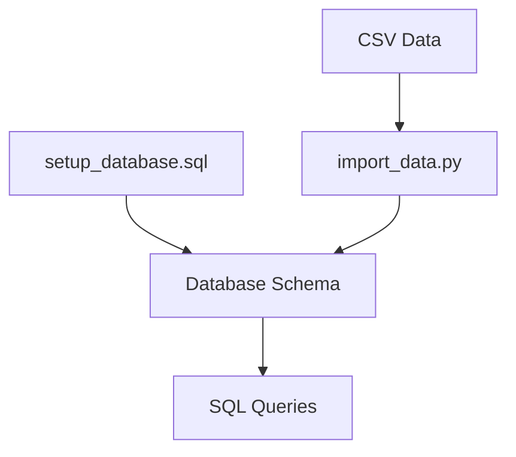

# SQL Folder

This folder contains scripts for database setup and data import.

## Structure
- `setup_database.sql`: SQL script to create tables and schema.
- `import_data.py`: Python script to import CSV data into the database.
- `basic_queries.sql`: Example queries for data exploration.

## Database Workflow

The database is set up using `setup_database.sql`, data is imported with `import_data.py`, and queries are run using `basic_queries.sql`. 