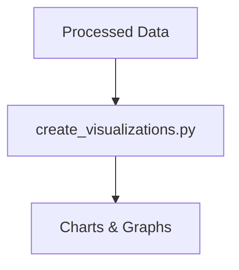

# Visualizations Folder

This folder contains scripts for generating visualizations from processed data.

## Structure
- `create_visualizations.py`: Main script for creating charts and plots.

## Visualization Workflow

Processed data is loaded and visualized using the scripts in this folder. 